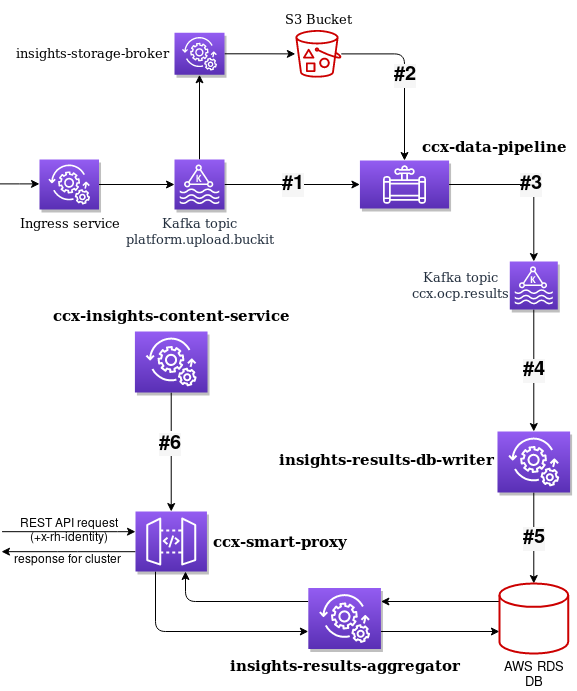

# Insights Data Schemas

## External data pipeline

[Incoming messages in `platform.upload.buckit`](platform_upload_buckit_messages.md)

## Internal data pipeline

[Incoming messages from SQS](incoming_sqs_messages.md)

## Implemented validators

[validators.md](validators.md)

## Documentation for Python packages

[validators.py](packages/validators.html)
