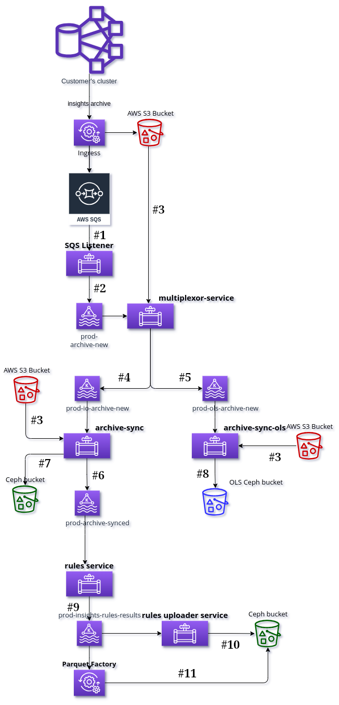
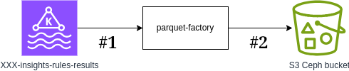

\[[Front page](index.md)\]

# Insights Data Schemas

## Internal data pipeline

Internal data pipeline is responsible for processing Insights Operator
archives, transforming data, and aggregating results into reports that later
will be served by API and UI.

It takes care of OpenShift Lightspeed generated archives, storing them into
an internal storage.

### Whole data flow

SQS listener service listens to notifications sent to AWS SQS (Simple Queue
Service) about new files in the S3 bucket. It sends a message with S3 path of
the file to `[qa|prod]-archive-new` Kafka topic for every new file in S3.

Multiplexor Service downloads every archive specified by the path from
`[qa|prod]-archive-new` Kafka topic, and checks if it is an Insights Operator
archive or an Openshift Lightspeed one. Those archives will be published
respectively into `[qa|prod]-io-archive-new` and `[qa|prod]-ols-archive-new`
Kafka topics.

Archive Sync Service synchronizes every new archive by reading the related
information from `[qa|prod]-io-archive-new` Kafka topic, downloading the archive
from AWS S3 and uploading it to DataHub (Ceph) bucket. Information about
synchronized archive and its metadata are sent to `[qa|prod]-archive-synced`
Kafka topic.

Archive Sync OLS Service synchorizes every new archive by reading the related
information from `[qa|prod]-ols-archive-new` Kafka topic, downloading the archive
from AWS S3 and uploading it to DataHub (Ceph) bucket. The bucket where the
Openshift Lightspeed archives are stored is different from the Insights Operator
ones.

Rules Service runs rules for all archives synced in DataHub (Ceph) bucket. It
reads messages from `[qa|prod]-archive-synced` Kafka topic to know about incoming
archives in Ceph and it will download the archive from DataHub (Ceph) bucket. The
result of the applied rules is sent to `[qa|prod]-insights-rules-results` Kafka
topic.

Rules Uploader Service writes the results published in the
`[qa|prod]-insights-rules-results` into a JSON file and uploads it to DataHub
(Ceph) bucket.

Parquet Factory is a program that can read data from `[qa|prod]-insights-rules-results`
Kafka topic, aggregate the data received from it and generate a set of Parquet files
with the aggregated data, storing them in a selected S3 or Ceph bucket. It is used
to generate different data aggregations in the CCX Internal Data Pipeline,
reading data from Kafka topics.

### Architecture diagram

<map name="internal-pipeline">
    <!-- #1 -->
    <area shape="rect" coords="178, 435, 205, 465"    title="Incoming messages from SQS" alt="internal-pipeline/incoming_sqs_messages.html" href="internal-pipeline/incoming_sqs_messages.html">
    <!-- #2 -->
    <area shape="rect" coords="178, 540, 205, 565"    title="Messages produced by SQS listener" alt="internal-pipeline/sqs_listener_messages.html" href="internal-pipeline/sqs_listener_messages.html">
    <!-- #3 -->
    <area shape="rect" coords="290, 390, 320, 415"    title="Raw data stored in S3 bucket" alt="internal-pipeline/raw_data_S3_bucket.html" href="internal-pipeline/raw_data_S3_bucket.html">
    <area shape="rect" coords=" 60, 795,  85, 820"    title="Raw data stored in S3 bucket" alt="internal-pipeline/raw_data_S3_bucket.html" href="internal-pipeline/raw_data_S3_bucket.html">
    <area shape="rect" coords="510, 860, 545, 890"    title="Raw data stored in S3 bucket" alt="internal-pipeline/raw_data_S3_bucket.html" href="internal-pipeline/raw_data_S3_bucket.html">
    <!-- #4 -->
    <area shape="rect" coords="220, 710,  250, 740"   title="Messages produced by multiplexor service into [qa|prod]-io-archive-new" alt="internal-pipeline/io_archive_new.html" href="internal-pipeline/io_archive_new.html">
    <!-- #5 -->
    <area shape="rect" coords="340, 710,  370, 740"   title="Messages produced by multiplexor service into [qa|prod]-ols-archive-new" alt="internal-pipeline/ols_archive_new.html" href="internal-pipeline/ols_archive_new.html">
    <!-- #6 -->
    <area shape="rect" coords="120, 895,  205, 925"   title="Messages produced by archive-sync-service" alt="internal-pipeline/archive_sync_service_messages.html" href="internal-pipeline/archive_sync_service_messages.html">
    <!-- #7 -->
    <area shape="rect" coords=" 70, 875, 100, 902"    title="Raw data stored in Ceph bucket" alt="internal-pipeline/raw_data_Ceph_bucket.html" href="internal-pipeline/raw_data_S3_bucket.html">
    <!-- #8 -->
    <area shape="rect" coords="375, 890, 410, 920"    title="Raw data stored into Ceph bucket" alt="internal-pipeline/raw_data_Ceph_bucket.html" href="internal-pipeline/raw_ols_data_Ceph_bucket.html">
    <!-- #9 -->
    <area shape="rect" coords="125, 1150, 155, 1175"  title="Messages produced by Rules service" alt="internal-pipeline/rules_service_messages.html" href="internal-pipeline/rules_service_messages.html">
    <!-- #10 -->
    <area shape="rect" coords="420, 1220, 465, 1250"  title="Rules results stored in Ceph bucket" alt="internal-pipeline/rules_service_messages.html" href="internal-pipeline/rules_service_messages.html">
    <!-- #11 -->
    <area shape="rect" coords="229, 1115, 274, 1150"  title="Generated parquet files" alt="internal-pipeline/parquet_output.html" href="internal-pipeline/parquet_output.html">
</map>

### Data format descriptions

1. [Incoming messages from SQS](internal-pipeline/incoming_sqs_messages.md)
1. [Messages produced by SQS listener](internal-pipeline/sqs_listener_messages.md)
1. [Raw data stored in S3 bucket](internal-pipeline/raw_data_S3_bucket.md)
1. [Messages produced by multiplexor-service in `io-archive-new` topic](internal-pipeline/io_archive_new.md)
1. [Messages produced by multiplexor-service in `ols-archive-new` topic](internal-pipeline/ols_archive_new.md)
1. [Raw data stored into Ceph bucket](internal-pipeline/raw_data_Ceph_bucket.md)
1. [Raw data stored into Ceph bucket (OLS)](internal-pipeline/raw_ols_data_Ceph_bucket.md)
1. [Messages produced by archive-sync-service](internal-pipeline/archive_sync_service_messages.md)
1. [Messages produced by Rules service](internal-pipeline/rules_service_messages.md)
1. [Messages produced by Features service](internal-pipeline/features_service_messages.md)
1. [Rules results stored into Ceph bucket by rules-uploader-service](internal-pipeline/rules_results_output.md)
1. [Generated parquet files](internal-pipeline/parquet_output.md)

### Parquet factory

Parquet Factory is a program that can read data from several data sources,
aggregate the data received from them and generate a set of Parquet files with
the aggregated data, storing them in a S3 bucket. It is used to generate
different data aggregations in the CCX Internal Data Pipeline. Currently it only
reads data from one Kafka topics.

<map name="parquet-factory">
    <area shape="rect" coords="130, 34, 170, 64"   title="Messages consumed from ccx-XXX-insights-operator-archive-rules-results topic" alt="Messages consumed from ccx-XXX-insights-operator-archive-rules-results topic" href="internal-pipeline/parquet_rules_results.html">
    <area shape="rect" coords="130, 212, 170, 242" title="Messages consumed from ccx-XXX-insights-operator-archive-features topic" alt="Messages consumed from ccx-XXX-insights-operator-archive-features topic" href="internal-pipeline/parquet_features.html">
    <area shape="rect" coords="389, 165, 429, 195" title="Generated parquet files" alt="Generated parquet files" href="internal-pipeline/parquet_output.html">
</map>

1. [Messages consumed from `ccx-XXX-insights-operator-archive-rules-results` topic](internal-pipeline/parquet_rules_results.md)
2. [Messages consumed from `ccx-XXX-insights-operator-archive-features` topic](internal-pipeline/parquet_features.md)
3. [Generated parquet files](internal-pipeline/parquet_output.md)
